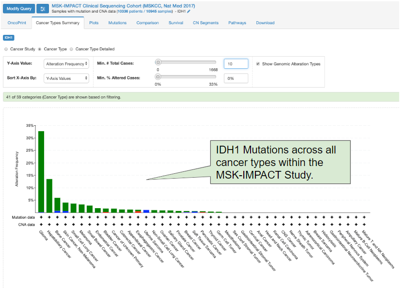
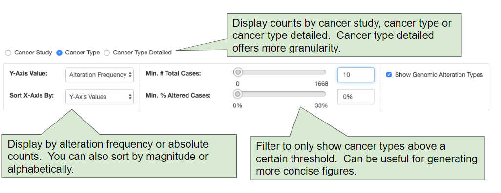
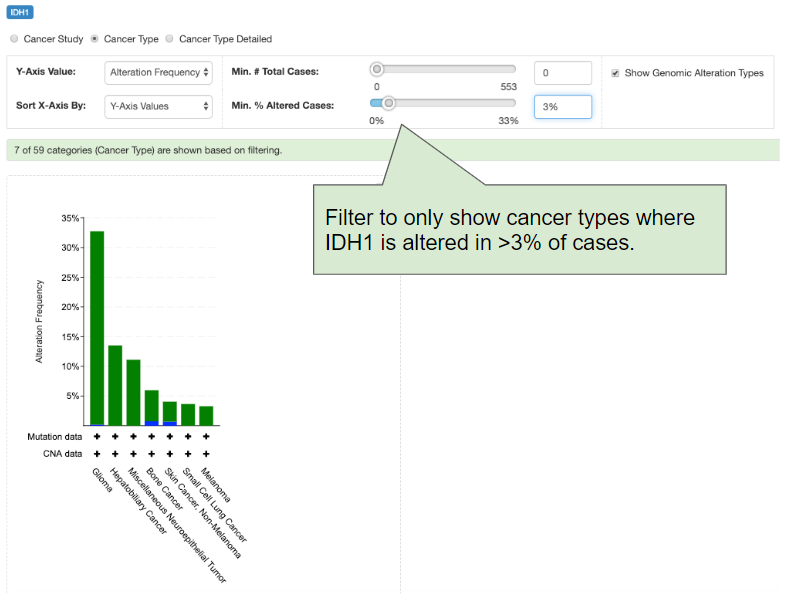

# Cancer Types Summary

## Introduction

The **Cancer Types Summary Tab** is most useful when you are analyzing cancer studies with > 1 cancer type.  For example, the [MSK-IMPACT cancer study](https://www.cbioportal.org/study/summary?id=msk_impact_2017) contains dozens of cancer types, all obtained during routine clinical sequencing.

As an example, you can assess [IDH1 mutations across all cancer types within the MSK-IMPACT cohort](http://bit.ly/2IAkJr4):

## Options

The Cancer Types Summary tab provides multiple configuration options:

For example, you can easily filter to only show cancer types where IDH1 is altered in >3% of all cases:

