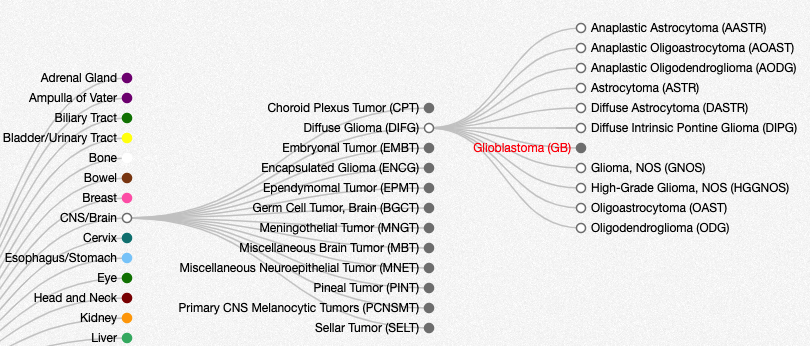

# Datasets
 
## Introduction

All data within cBioPortal is organized within studies.  You can think of a study as a published study with an accompanying research paper, or a pre-published study that has not yet made it to publication.  In the public cBioPortal, we maintain over 200 published cancer studies, and new studies are added all the time.

The exact details for each study will vary, but most studies are linked to a publication within PubMed, and contain some form of genomic profiling data coupled with de-identified clinical data. For example, the [Cholangiocarcinoma study from MSKCC](https://www.cbioportal.org/study/summary?id=chol_msk_2018) contains data on 192 patients. This includes mutation data and copy number data from a targeted gene panel, along with de-identified clinical data that was gathered from patient medical records.


For a complete list of studies within the cBioPortal page, go to:  https://www.cbioportal.org/datasets.  This page lists the study name, a publication reference, and number of samples for each data type, e.g. number of sequenced samples or number of samples with copy number data.


## Cancer Types

Where possible, each study within cBioPortal is associated with a specific cancer type, derived from the [OncoTree ontology](http://oncotree.mskcc.org/#/home).  The OncoTree ontology provides a tree-based structure for classifying cancers.  For example, Glioblastoma  is classified as a Diffuse Glioma, which is then categorized under CNS/Brain.  To find glioblastoma studies within cBioPortal, you can therefore select CNS/Brain studies and start browsing or simply enter "Glioblastoma" in the main search box.  Note that studies which span multiple cancer types are categorized as "Pan Cancer" studies.  We also maintain cell line studies, such as the Cancer Cell Line Encyclopedia, which are categorized as "Cell Line" studies.


The cBioPortal only contains **de-identified clinical data**.  That means that we do not store any protected health information (PHI) for patients, such as birth dates or medical record numbers, but we do store de-identified data, such as overall survival, patient demographics and prior treatment.  Published cancer genomics studies, including TCGA and AACR GENIE also require explicit patient consent to share de-identified clinical data.


## TCGA Studies

For The Cancer Genome Atlas (TCGA) project, we currently maintain three different types of studies.

 * **Published TCGA Studies**:  These studies match the published data that accompanied a specific TCGA marker paper.
 * **Legacy TCGA Studies**:  These studies are based on the [Firehose Pipeline](https://gdac.broadinstitute.org/), previously maintained by the Broad Institute.
 * **Pan-Cancer TCGA Studies**:  These studies are based on the [TCGA Pan Cancer initiative](https://www.cell.com/pb-assets/consortium/pancanceratlas/pancani3/index.html).  This was a multi-institutional initiative focused on analyzing ~11,000 tumors across 33 TCGA cancer types.  All genomic data within the Pan-Cancer initiative were processed with a uniform set of pipelines and clinical data were more fully harmonized across cancer types.  Within cBioPortal, we provide one Pan-Cancer study per cancer type -- for example, we provide the [Uveal Melanoma Pan-Cancer study](https://www.cbioportal.org/study/summary?id=uvm_tcga_pan_can_atlas_2018), and the [Adrenocortical Carcinoma Pan-Cancer study](https://www.cbioportal.org/study/summary?id=acc_tcga_pan_can_atlas_2018).

When possible, we recommend using the latest Pan-Cancer TCGA Studies, as these studies have been more uniformly processed for comparative analyses.


The cBioPortal does not currently store genomic data derived from the [NCI Genomic Data Commons](https://gdc.cancer.gov/).  Note also, that the GDC maintains its own set of [standardized genomic pipelines](https://gdc.cancer.gov/about-data) which they use to re-process and re-analyze TCGA data.



If you compare data across published TCGA studies, Legacy TCGA Studies, Pan-Cancer TCGA Studies and GDC Re-processed TCGA Studies, you may notice some small differences in the data.  This is due to the variability in how genomic data was processed.  For example, in the published TCGA studies, mutation calls were usually derived by the sequencing center which performed the sequencing, and each of the three main sequencing centers in TCGA maintained their own independent NGS pipelines.  Furthermore, the Pan-Cancer Initiative and the GDC now maintain their own independent NGS Pipelines.

For a more detailed comparison, please see:  [Before and After: A Comparison of Legacy and Harmonized TCGA Data at the Genomic Data Commons](https://www.ncbi.nlm.nih.gov/pubmed/31344359) and [MC3:  Scalable Open Science Approach for Mutation Calling of Tumor Exomes Using Multiple Genomic Pipelines](https://www.ncbi.nlm.nih.gov/pmc/articles/PMC6075717/).


## AACR GENIE

The cBioPortal team maintain a separate cBioPortal instance just for [AACR GENIE data](https://www.aacr.org/professionals/research/aacr-project-genie/).  AACR GENIE is a multi-institutional data sharing initiative focused on precision cancer medicine.  To access AACR GENIE data, you must first register and agree to the AACR GENIE terms of use.  Complete details are available at:  https://genie.cbioportal.org/.

## cBioPortal DataHub

If you want to analyze any cBioPortal data locally with your own tools, e.g. with Python or R, we also maintain a [cBioPortal DataHub](https://github.com/cBioPortal/datahub) on GitHub.  From here, you can easily download the complete data set for any study that you see within the public cBioPortal.