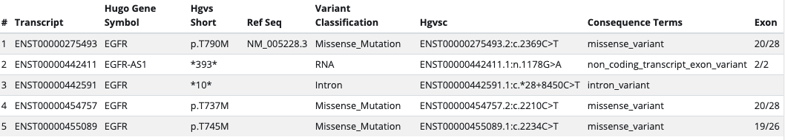

# Mutations

## Introduction

The **Mutations Tab** provides multiple views of mutation data.  We begin with a quick background on variant annotation.

## Mapping to UniProt Canonical Sequences

Unlike the Genomic Data Commons (GDC), the cBioPortal does not currently use a standardized genomics pipeline to re-call variants from primary BAM or FASTQ files.  Rather, we rely on the variants called by the source provider or publication.   However, we do re-annotate all variants to a standard set of protein sequences.

To understand how this works, consider that you have a single C>T variant on chromosome 7: [7:g.55249071C>T](https://www.genomenexus.org/variant/7:g.55249071C%3ET).  Prior to loading into cBioPortal, we automatically re-annotate this variant via [Variant Effect Predictor (VEP)](https://useast.ensembl.org/info/docs/tools/vep/index.html).  This results in multiple possible protein changes, each of which will depend on the chosen gene transcript:

All of these protein changes are potentially valid, but cBioPortal always chooses the gene transcript linked to the Canonical UniProt protein sequence.  In the example above, that means that we select the transcript:  [ENST00000275493](https://useast.ensembl.org/Homo_sapiens/Transcript/Summary?db=core;g=ENSG00000146648;r=7:55019017-55211628;t=ENST00000275493), which is linked to the Canonical UniProt EGFR sequence [P00533](https://www.uniprot.org/uniprot/P00533).  Using this transcript, the mutation 7:g.55249071C>T results in the EGFR missense variant of p.T790M.  Only variant information linked to the canonical UniProt sequence is stored within cBioPortal, but we do provide linked-outs (described below) for you to explore non-canonical sequence variants.


For additional information regarding Canonical UniProt Sequences, please refer to the UniProt Documentation:  [What is the canonical sequence?](https://www.uniprot.org/help/canonical_and_isoforms)  We also [provide a mapping file of all Canonical UniProt sequences](https://github.com/mskcc/vcf2maf/blob/master/data/isoform_overrides_uniprot).



Protein domain definitions are also derived from the UniProt canonical sequence and are based on [PFAM](http://pfam.xfam.org/) domains.


## Variant Annotation

cBioPortal provides additional layers of variant annotation, including:

 * Cancer Hotspots:  statistically significant mutation hotspots, as identified by [Cancer Hotspots](https://cancerhotspots.org/) and [3D Hotspots](https://3dhotspots.org/).
 * Therapeutic Indication:  including annotation records from [OncoKB](https://www.oncokb.org/), [CIVIC](https://civicdb.org/), and [My Cancer Genome](https://www.mycancergenome.org/).
 * Functional Impact:  including predictions from [Mutation Assessor](http://mutationassessor.org/), [SIFT](https://sift.bii.a-star.edu.sg/), and [PolyPhen-2](http://genetics.bwh.harvard.edu/pph2/).
 * Post-Translational Modifications (PTMs):  derived from [dbPTM](http://dbptm.mbc.nctu.edu.tw/). 
 
 
 Additional annotations from [COSMIC](https://cancer.sanger.ac.uk/cosmic), [dbSNP](https://www.ncbi.nlm.nih.gov/snp/), [ClinVar](https://www.ncbi.nlm.nih.gov/clinvar/), and [gnomAD](https://gnomad.broadinstitute.org/) are also made available.


Most variant annotations are automatically provided via [Genome Nexus](https://www.genomenexus.org/), a separate variant annotation service maintained by MSKCC. 

