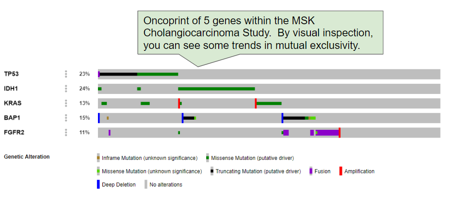
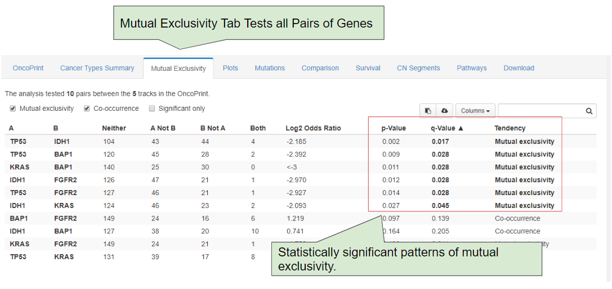

# Mutual Exclusivity

## Introduction

The **Mutual Exclusivity Tab** takes all pairs of genes you have specified, and indicates whether genomic alterations in these genes tend to be mutually exclusive or co-occurring.  This tab is particularly useful if you observe certain genomic patterns in the OncoPrint tab, and want to know if these patterns are statistically significant.

## Statistical Tests

cBioPortal uses a one-sided [Fisher's Exact Test](https://en.wikipedia.org/wiki/Fisher%27s_exact_test) to determine if the observed pattern of events would be observed in the null hypothesis, where genomic events are completely random.  A low p-value indicates that the observed pattern is unlikely to be be observed in the null hypothesis, and the pattern is more likely due to some biological phenomena.  We also use the [Log2 Odds Ratio](https://en.wikipedia.org/wiki/Odds_ratio) to assess the direction of association, where negative values indicate trends towards mutual exclusivity and positive values indicate trends towards co-occurrence.  To adjust for multiple hypotheses across multiple gene pairs, we use the [Benjamini–Hochberg False Discovery Rate Correction Procedure](http://www.biostathandbook.com/multiplecomparisons.html).


Mutually exclusive events may indicate that the specified genes are functionally redundant or members of the same biological pathway or process.  For additional background, see: [Mutual exclusivity analysis identifies oncogenic network modules](https://www.ncbi.nlm.nih.gov/pmc/articles/PMC3266046/) and [Systematic identification of cancer driving signaling pathways based on mutual exclusivity of genomic alterations](https://www.ncbi.nlm.nih.gov/pubmed/25887147).  


## Example

As an example, let's assess a set of [key genes with the Cholangiocarcinoma study from MSKCC](http://bit.ly/2TSMeBp).  First, we can assess the OncoPrint and visually observe some trends in mutual exclusivity.  For example, it appears that mutations in TP53 are mutually exclusive of mutations in IDH1 and BAP1, and both of these are mutually exclusive of structural rearrangements in FGFR2:

We can then further assess these events via the Mutual Exclusivity Tab:

By default, the Mutual Exclusivity Tab will assess all pairs of genes.  You can now observe that several of these pairs, including TP53:IDH1, TP53:BAP1, and IDH1:FGFR2, etc. are statistically significant.
