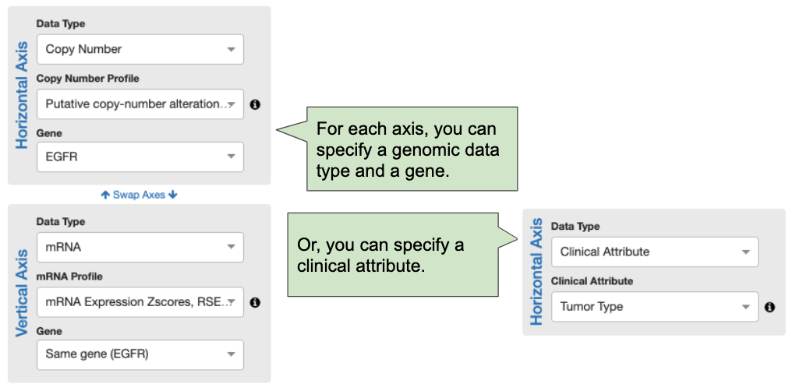
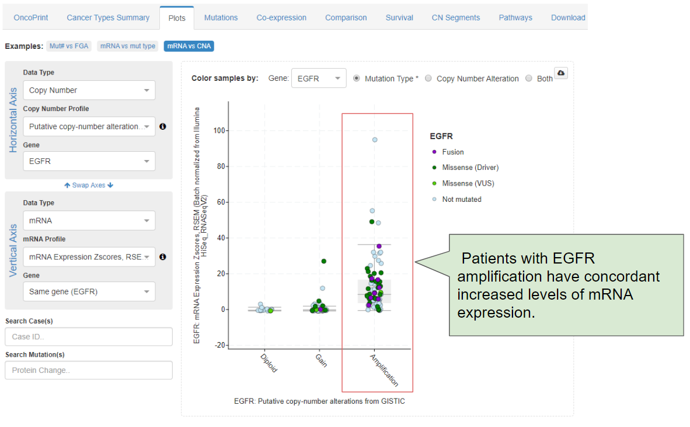
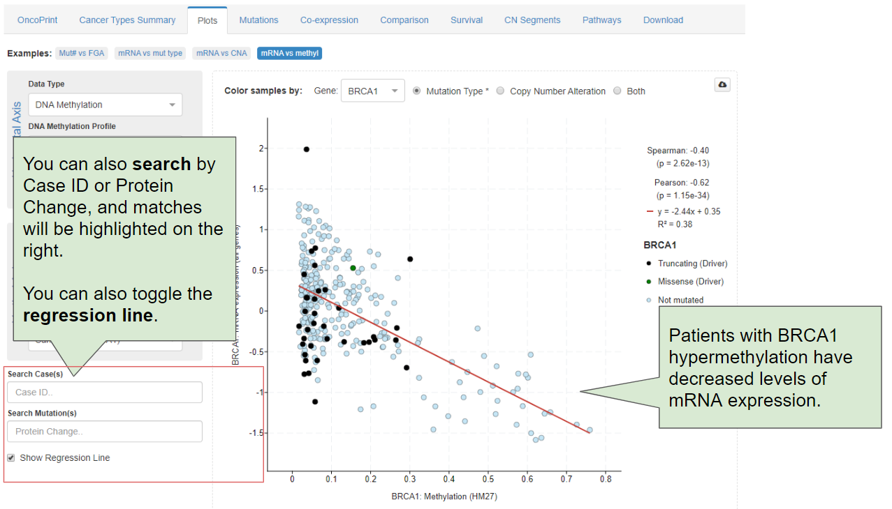

# Plots

## Introduction

The Plots tab provides a flexible, interactive interface for creating plots.  Depending on the fields you select for x or y, you can easily generate multiple plot types.  For example, if you select a categorical variable for x and a continuous variable for y, you can generate **box plots**;  if you select two continuous variables, you can generate **scatter plots**, etc.

## Options

The plots tab provides numerous options for configuring plots.

For example, for each axis, you can specify a genomic data type and gene or a clinical attribute:

Note that you can also swap the x and y axes.

## Example 1

In our first example, we can assess [EGFR amplifications in Glioblastoma](http://bit.ly/39FMxpz):

In this case, we can observe that patients with EGFR amplification have concordant increased levels of EGFR mRNA expression. 

## Example 2

In our second example, we can assess [BRCA1 methylation and mRNA expression in Ovarian Cancer](http://bit.ly/337LGeS):

In this case, we can observe that patients with BRCA1 hypermethylation have concordant decreased levels of BRCA1 mRNA expression.